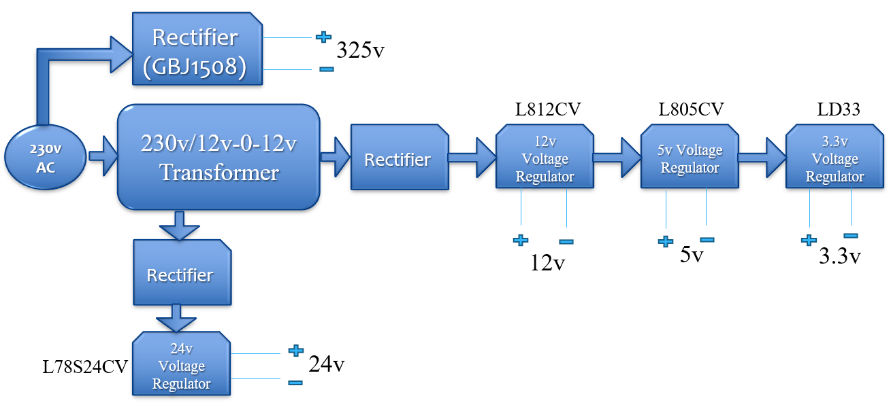

# Futuristic Model of Automatic Electric Cooking Machine

### M.Tech Thesis Project | Electrical Engineering
**Arjun Vallyath Anil** *Rajiv Gandhi Institute of Technology*

---

## Project Overview
The objective was to design and build a fully automated electric cooking machine capable of preparing food autonomously upon receiving orders via a mobile application. While this system includes robotics and mobile integration, my primary research and development focused on **Power Electronics, Motor Control Systems, and Hardware Design**. The current prototype serves as a high-fidelity testbed for electrical control. Advanced AI, Human-Robot Interaction (HRI), and fully autonomous arm path-planning are considered **Future Scope** for subsequent iterations of this research.

### The Vision
As the demand for convenience grows, this technology serves as a solution for:
* **Busy Professionals:** Streamlining meal prep for individuals with tight schedules.
* **Future Automated Restaurants:** Reducing labor costs and ensuring consistent food quality through robotics.

---

## 📄 Published Research
The core innovations of this project were presented and published at the **IEEE International Conference on Emerging Trends in Engineering Science and Technology (2020)**.

> **Citation:** > Arjun V.A, Meera Khalid, “Futuristic Model of Automatic Electric Cooking Machine”, *IEEE International Conference on Emerging Trends in Engineering Science and Technology*, December 2020.  
> **DOI:** [10.1109/PICC51425.2020.9362400](https://doi.org/10.1109/PICC51425.2020.9362400)  
> **Full Paper:** [Read on IEEE Xplore](https://ieeexplore.ieee.org/document/9362400)

---
## 🛠 Technical Architecture
The system is divided into five distinct electrical sections, coordinated by a central mother controller.
* Power supply
* BLDC Motor & PID Control
* Quasi-Resonant Converter for Induction Heating
* Robotic Arm
* IOT with ESP8266

### 1. Power Supply Module
This section comprises a step-down transformer, a bridge rectifier, and multiple voltage regulators. The primary role of this module is to provide regulated electrical power to the various subsystems of the prototype. The specific voltage requirements for each component are as follows:
* **Resonant Converter:** 310V (Rectified Mains)
* **BLDC Motor:** 24V
* **IR2110 Gate Driver:** 12V & 5V
* **Servo Motors:** 6V
* **ESP8266 NodeMCU:** 5V
* **dsPIC33FJ32MC202:** 3.3V

Voltage regulators are employed to maintain the supply within the specific tolerances required by the electrical hardware. The design utilizes a suite of regulators, including the LM350, LM338, L7812, L7805, and LD33.The process begins by stepping down the 230V AC mains to 24V AC using a transformer, followed by rectification to DC. This 24V DC rail is then distributed to the LM350 and LM338 regulators.

### 2. BLDC Motor & PID Control
A critical part of the cooking process is regulating the speed of the BLDC motor based on real-time temperature. 
* **Controller:** dsPIC33FJ32MC202 (Digital Signal Controller).
* **Feedback:** Hall sensors (Ha, Hb, Hc) provide rotor position for precise commutation through a custom inverter and MOSFET driver circuit.

### 3. Quasi-Resonant Induction Heating
I focused on the design of a **Quasi-Resonant Inverter** to achieve Zero Voltage Switching (ZVS), which minimizes power loss during high-frequency induction.

* **Simulation:** Validated using **MATLAB/Simulink**.
* **Waveform Analysis:** The design ensures the IGBT (T1) switches at the optimal point of the resonant cycle to maximize efficiency.

---

---

## 🚀 Future Scope
* **Autonomous Robotics:** Implementing Inverse Kinematics (IK) for the 5-DOF arm.
* **AI & HRI:** Integrating voice recognition and adaptive recipe learning.
* **Thermal Vision:** Using IR sensors for smarter ingredient detection.
