# Futuristic Model of Automatic Electric Cooking Machine

### M.Tech Thesis Project | Electrical Engineering
**Arjun Vallyath Anil** *Rajiv Gandhi Institute of Technology*

---

## Project Overview
The objective was to design and build a fully automated electric cooking machine capable of preparing food autonomously upon receiving orders via a mobile application. While this system includes robotics and mobile integration, my primary research and development focused on **Power Electronics, Motor Control Systems, and Hardware Design**. The current prototype serves as a high-fidelity testbed for electrical control. Advanced AI, Human-Robot Interaction (HRI), and fully autonomous arm path-planning are considered **Future Scope** for subsequent iterations of this research.

### The Vision
As the demand for convenience grows, this technology serves as a solution for:
* **Busy Professionals:** Streamlining meal prep for individuals with tight schedules.
* **Future Automated Restaurants:** Reducing labor costs and ensuring consistent food quality through robotics.

---

## 📄 Published Research
The core innovations of this project were presented and published at the **IEEE International Conference on Emerging Trends in Engineering Science and Technology (2020)**.

> **Citation:** > Arjun V.A, Meera Khalid, “Futuristic Model of Automatic Electric Cooking Machine”, *IEEE International Conference on Emerging Trends in Engineering Science and Technology*, December 2020.  
> **DOI:** [10.1109/PICC51425.2020.9362400](https://doi.org/10.1109/PICC51425.2020.9362400)  
> **Full Paper:** [Read on IEEE Xplore](https://ieeexplore.ieee.org/document/9362400)

---
---
## 🛠 Technical Architecture
The system is divided into five distinct electrical sections, coordinated by a central mother controller.
* Power supply
* BLDC Motor & PID Control
* Quasi-Resonant Converter for Induction Heating
* Robotic Arm
* IOT with ESP8266
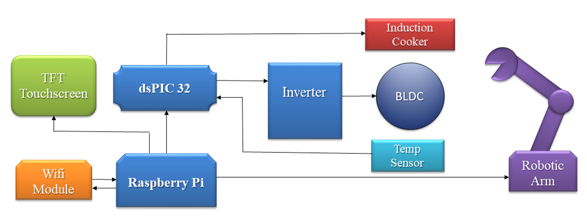

## 1. Power Supply Module
This section comprises a step-down transformer, a bridge rectifier, and multiple voltage regulators. The primary role of this module is to provide regulated electrical power to the various subsystems of the prototype. The specific voltage requirements for each component are as follows:
* **Resonant Converter:** 310V (Rectified Mains)
* **BLDC Motor:** 24V
* **IR2110 Gate Driver:** 12V & 5V
* **Servo Motors:** 6V
* **ESP8266 NodeMCU:** 5V
* **dsPIC33FJ32MC202:** 3.3V

### Circuit Operation & Regulation
The design utilizes a multi-stage regulation strategy to maintain strict voltage tolerances across all hardware. The regulation suite includes the **LM350**, **LM338**, **L7812**, **L7805**, and **LD33**.

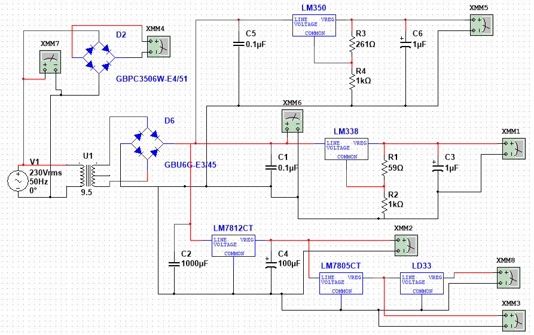

### The Conversion Process:
1.  **Step-Down & Rectification:** The 230V AC mains is stepped down to 24V AC via a transformer and rectified to DC. This 24V DC rail serves as the primary input for the high-current regulators.
2.  **High-Power Rails:** * The **LM338** provides a 12V, 5A output specifically for the BLDC motor drive and the L7812 stage.
    * The **LM350** provides a 6V, 3A output dedicated to the six servo motors within the robotic arm.
3.  **Logic & Control Rails:** * The 12V DC output from the **L7812** powers the **IR2110** gate driver.
    * This 12V rail is further regulated by the **L7805** (5V for the ESP8266) and the **LD33** (3.3V for the dsPIC33FJ32MC202 microcontroller).

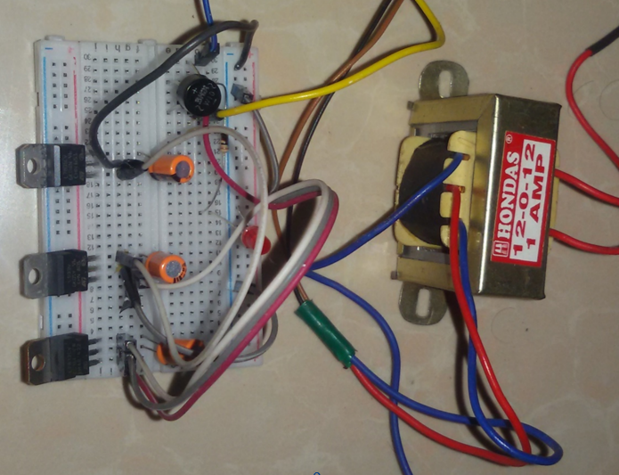

---

## 2. BLDC Motor Control System

This section details the implementation of the Brushless DC (BLDC) motor control, focusing on the commutation logic, driver circuitry, and the integration of the dsPIC33FJ32MC202 microcontroller.

### Motor Theory and Operation
The BLDC motor used in this prototype is a synchronous motor featuring surface-mounted permanent magnets on the rotor and poly-phase armature windings on the stator. 

* **Working Principle:** Mechanical torque is developed through the interaction between the magnetic field of the rotor magnets and the electromagnetic field produced by the stator coils.
* **Feedback Mechanism:** To achieve precise commutation, multiple Hall-effect sensors are utilized to detect the real-time position of the rotor.

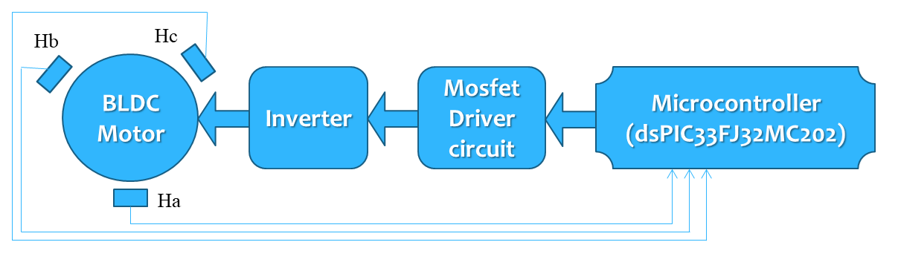

### Inverter & Driver Circuitry
A **3-phase bridge inverter** consisting of six MOSFET switches is employed to drive the motor. The switching sequence is determined by the Hall sensor inputs to ensure the stator windings are energized in the correct order.

#### High-Speed Gate Driving (IR2110)
Because the **dsPIC33** microcontroller operates at a 3.3V logic level, it cannot directly trigger the MOSFETs, which require a 12V gate-to-source voltage ($V_{GS}$) for efficient switching.

* **Driver Role:** The **IR2110** high-voltage, high-speed driver acts as the bridge. It independently handles high and low-side referenced output channels.
* **Level Shifting:** It boosts the 3.3V PWM signals from the controller to the 12V range required by the MOSFET gates.
* **Specifications:** The IR2110 operates within a 10V to 20V supply range and provides a peak output current of 2.5A, ensuring rapid charging of the MOSFET gate capacitance.

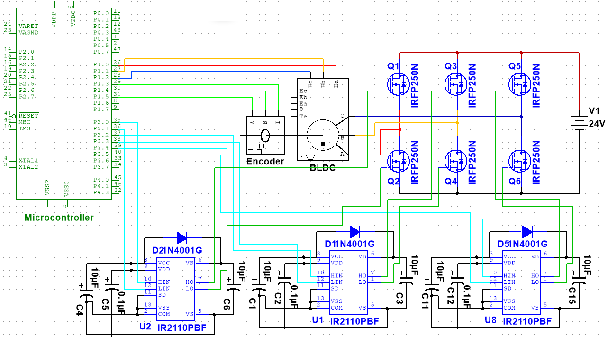

### Microcontroller Implementation
The **dsPIC33FJ32MC202** Digital Signal Controller (DSC) serves as the "brain" for the motor control:
1.  **Input:** Receives feedback from Hall-effect sensors and the encoder.
2.  **Processing:** Processes the feedback signals against a predefined switching table.
3.  **Output:** Generates high-frequency PWM signals. By adjusting the duty cycle of these signals, the effective voltage (and thus the current) is regulated, allowing for precise control of motor speed and torque.

### Experimental Validation
To verify the hardware design and validate the switching logic, a staged testing approach was implemented:

1. **Initial Logic Validation:** During the breadboard prototyping phase, an **Arduino UNO** was used to generate the commutation signals. This allowed for rapid verification of the switching cycle and Hall sensor feedback logic without the complexity of configuring the dsPIC's peripheral registers.
2. **Driver Testing:** The MOSFET driver circuit (IR2110) was tested independently to ensure the 3.3V-to-12V level shifting was stable and that the gate signals were clean.
3. **Final Implementation:** Once the switching logic and power stages were validated, the control was migrated to the **dsPIC33FJ32MC202** for the final PCB implementation to take advantage of its high-speed PWM and DSP capabilities.

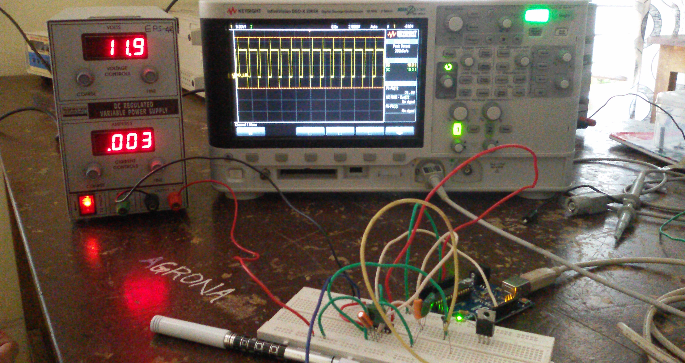

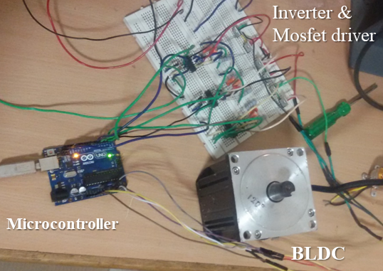

---

## 3. Quasi-Resonant Induction Heating

Induction heating offers significant advantages over traditional resistive coils or gas stoves, including rapid heating, superior thermal efficiency, and precise temperature control. This section details the design of the high-frequency resonant inverter used to convert electrical energy into magnetic energy for heating.

### Inverter Topology Selection
For this project, a **Single-Ended (SE) Quasi-Resonant (QR) Inverter** was selected. While Half-Bridge (HB) inverters are common for high-power industrial use, the SE topology was chosen for its:
* **Cost-Efficiency:** Requires only one switching device (IGBT) and a single resonant capacitor ($C_r$).
* **Suitability:** Perfectly suited for domestic applications under 2kW, which meets our system's requirements.
* **Soft-Switching:** Enables Zero Voltage Switching (ZVS), reducing switching losses and improving overall energy conversion efficiency.

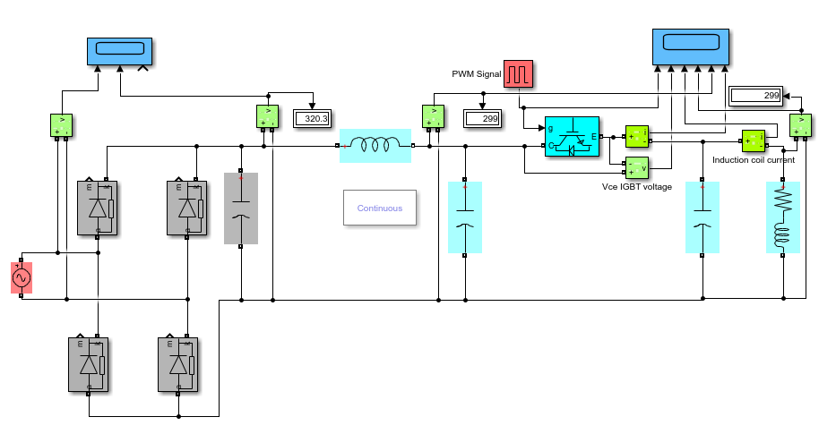

### Circuit Theory and Mathematical Modeling
The Single-Ended Parallel Resonant Converter utilizes a tank network formed by the inductor ($L_r$) and capacitor ($C_r$). The peak voltage ratings for the switch and capacitor (typically 1,200V) are calculated based on loading conditions and maximum mains voltage.

The power source for this converter is rectified line voltage (unfiltered) to achieve a near-unity power factor. 
* **Frequency Range:** We employ a switching frequency control scheme operating between **20kHz and 60kHz**. 
* **Acoustic Noise Mitigation:** By staying above 20kHz, we avoid the human audible range.
* **Power Scaling:** The system utilizes a "Soft Start" beginning at 60kHz, gradually reaching maximum power at the lower frequency bound of 20kHz.

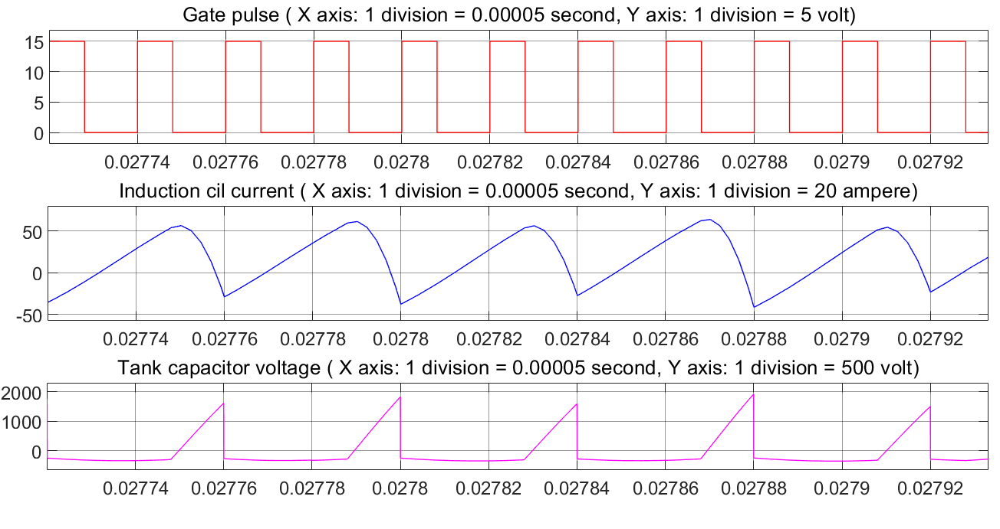

---
## 4. 5-DOF Robotic Arm & System Integration

For the ingredient handling system, I utilized a custom-designed **5-DOF (Degrees of Freedom) robotic arm**. This manipulator was responsible for the precise pick-and-place operation of food ingredients into the induction heating zone.
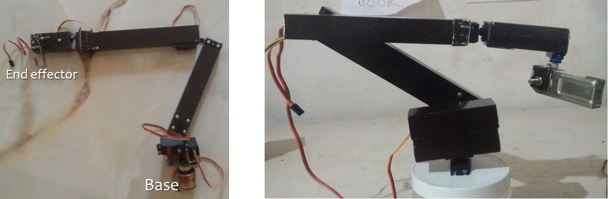

### Scope and Evolution
It is important to note the developmental timeline of this system:
1. **2019 - 2020 (M.Tech Thesis):** The primary focus was on the **Power Electronics and Motor Control** (as detailed in Sections 1-3). The robotic arm used in this prototype operated on a structured sequence rather than autonomous environmental sensing.
2. **2022 - 2023 :** I later enhanced the cooking capability by utilizing a **Hiwonder Open-Source Robotic Arm**. 
* **Perception:** Integrated a **YOLOv8** object detection model to identify ingredients and cooking tools in real-time.
* **Compute:** The system runs on Raspberry Pi, which handles the real-time camera feed and executes the YOLOv8 model for object detection; it then runs the custom pancake-making algorithm to generate and transmit precise motor commands to the bus servos.

#### Video Demonstration: AI Pancake Robot
In this video, I programmed the robot to flip a pancake. It illustrates the trial-and-error process inherent in robotics and the successful application of vision-based control. (Click the image below to play)

> **Related Research:** > For my more recent work on autonomous navigation and intelligent manipulation in complex environments, please check my post [Intelligent Robotics: 5DOF robotic arm](https://www.linkedin.com/posts/arjunvallyath_robotics-ros-moveit-ugcPost-7441162898254671872-9Sew?utm_source=share&utm_medium=member_desktop&rcm=ACoAADHo6jcBMT62rYyRx6KptF3gk8TrPv92KWQ)

## 5. IoT Integration and Mobile Application

To enable remote operation and user interaction, I developed a custom mobile application using the **Blynk IoT platform**. This serves as the primary digital interface connecting the user to the automated cooking machine.

### System Workflow
The "App-to-Plate" process operates through a seamless wireless sequence:

1. **Menu Selection:** The user browses the available dishes and makes a selection using the Blynk mobile app.
2. **Remote Ordering:** Upon pressing the "Order" button, a command signal is transmitted via the cloud.
3. **Hardware Reception:** The **ESP8266 NodeMCU** module, which is integrated directly into the cooking machine's circuitry, receives this incoming order over Wi-Fi.
4. **Automated Preparation:** Once the command is parsed, the ESP8266 triggers the mother controller. This initiates the coordinated sequence of the robotic arm, BLDC motor, and induction heating system to prepare the food autonomously.

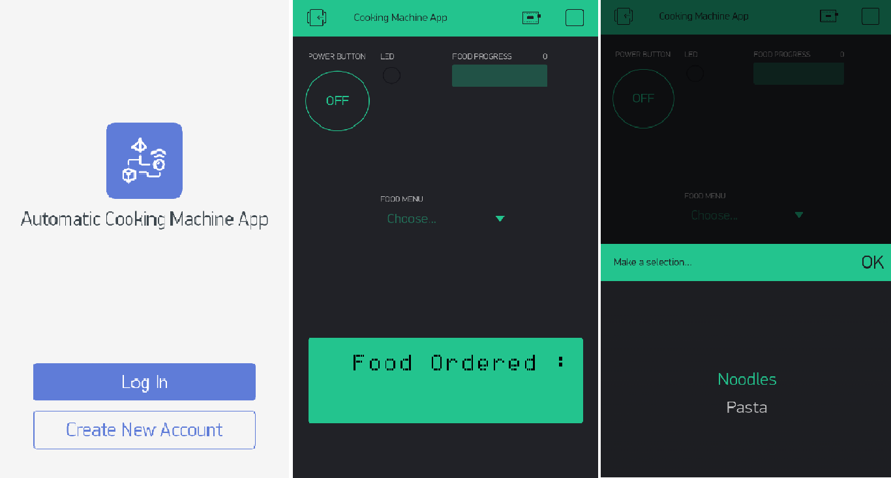

## Custom PCB Design & Final Prototype

To transition the project from a breadboard proof-of-concept to a robust, industrial-grade system, I designed a custom multi-layer Printed Circuit Board (PCB) using **Diptrace**.

### Hardware Consolidation
The custom PCB serves as the central hardware hub for the cooking machine, successfully integrating the distinct high-power and low-power modules onto a single board. It houses:
* The **Quasi-Resonant Converter** for the induction heating coil.
* The **3-Phase Inverter** and **IR2110 Driver Circuits** for the BLDC motor.
* The **Multi-Rail Power Supply** network (325V, 24V, 12V, 5V, 3.3V).

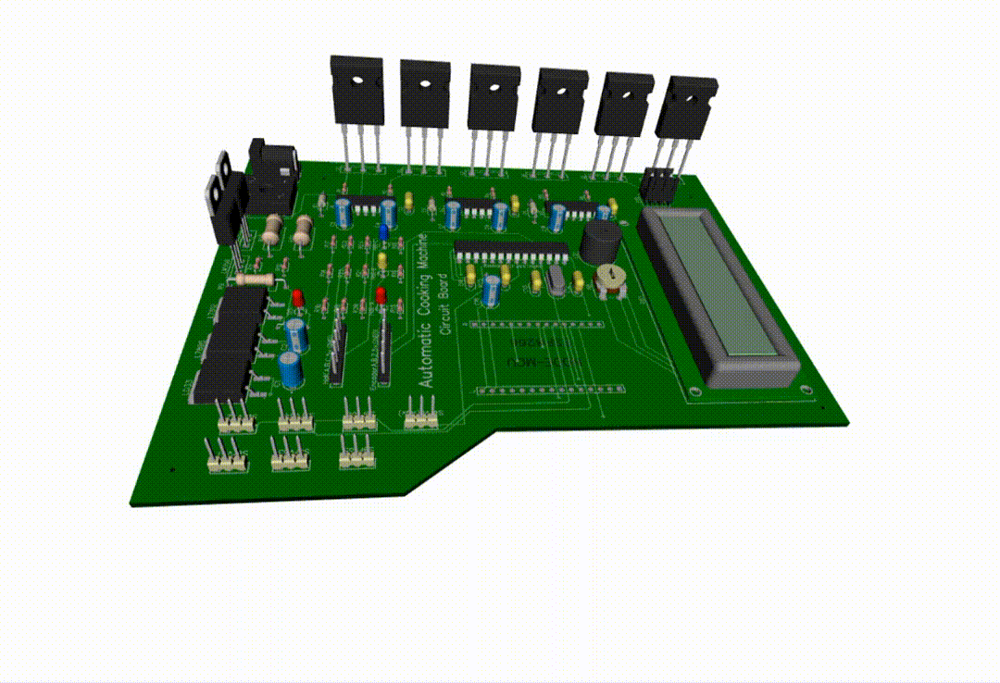

### The Final Assembled Prototype
The completed physical prototype brings all the mechatronic, power, and IoT systems into a single cohesive unit. Upon receiving the Blynk command, the mother controller successfully orchestrates the power delivery, induction heating, and 5-DOF robotic manipulation to autonomously cook the selected dish.

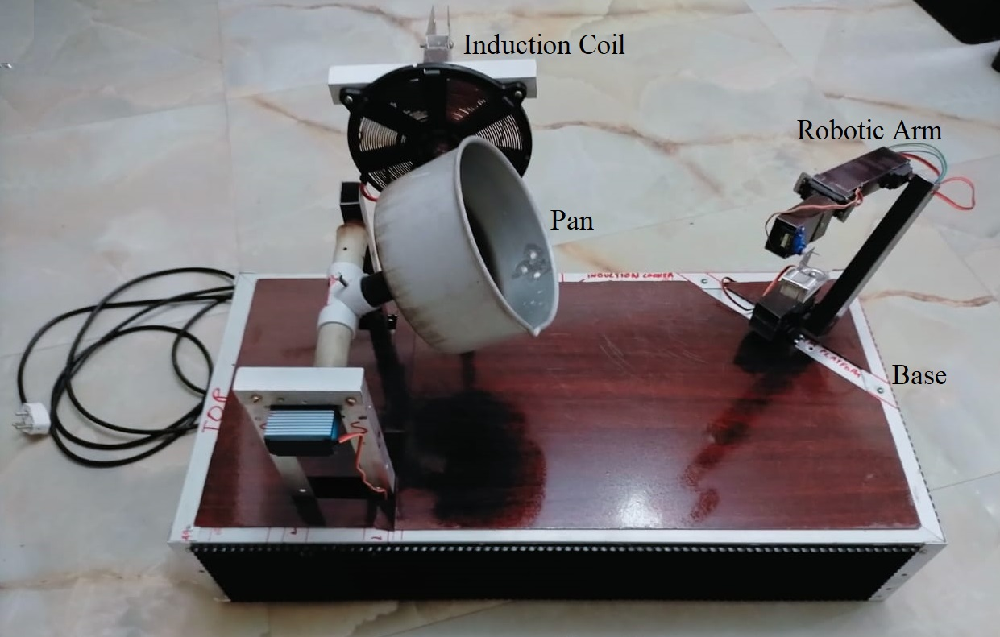

---

## 🚀 Future Scope
* **Autonomous Robotics:** Implementing Inverse Kinematics (IK) for the 5-DOF arm.
* **AI & HRI:** Integrating voice recognition and adaptive recipe learning.
* **Thermal Vision:** Using IR sensors for smarter ingredient detection.
